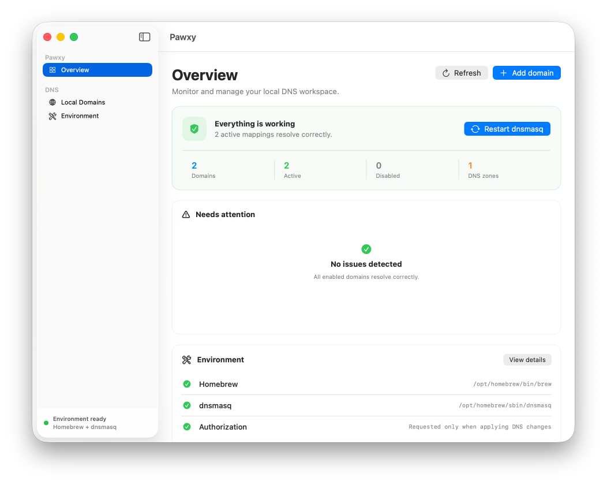
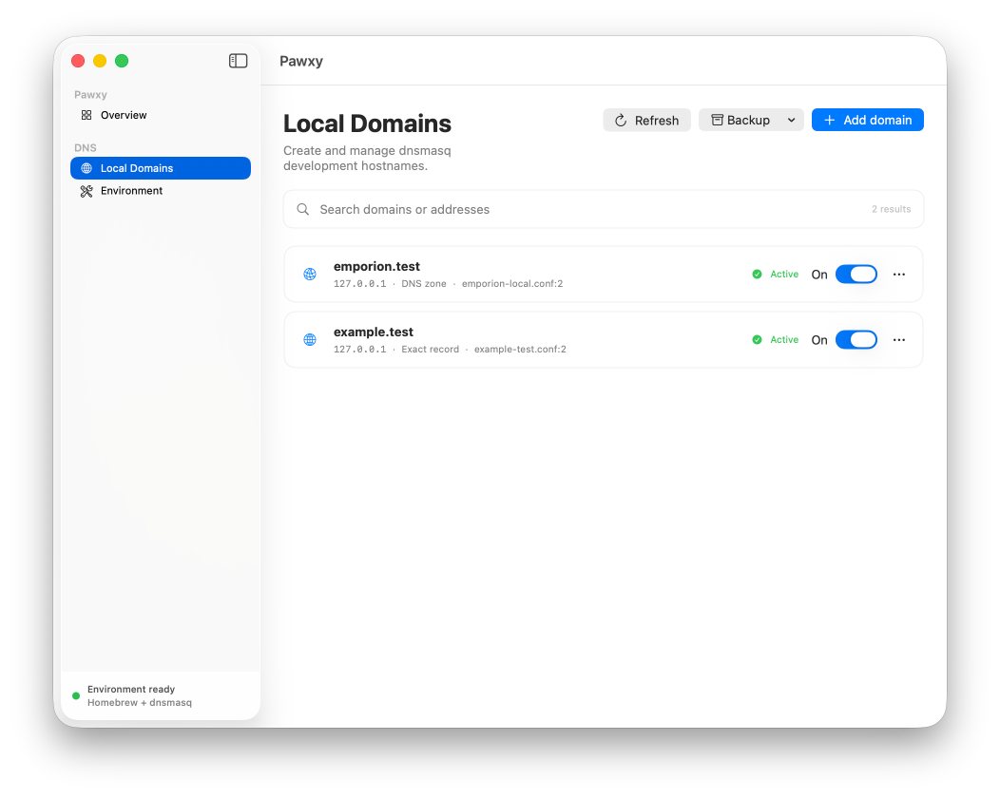
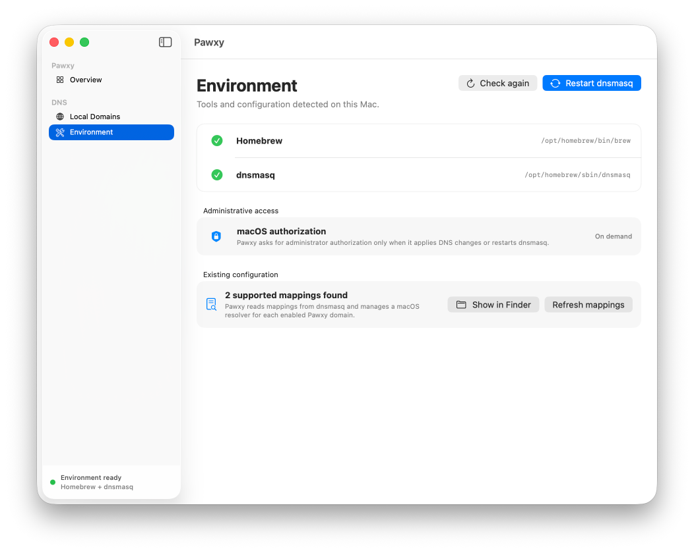

<p align="center">
  
</p>

<h1 align="center">Pawxy</h1>

<p align="center">
  <strong>Local DNS for macOS, without the configuration-file juggling.</strong>
</p>

<p align="center">
  <a href="https://github.com/dreamwhite/Pawxy/releases/latest"></a>
  <a href="https://github.com/dreamwhite/Pawxy/actions/workflows/ci.yml"></a>
  <a href="LICENSE"></a>
  
  
</p>

<p align="center">
  <a href="#screenshots">Screenshots</a> ·
  <a href="#why-pawxy">Why Pawxy?</a> ·
  <a href="#how-pawxy-compares">Compare</a> ·
  <a href="#features">Features</a> ·
  <a href="#installing-a-release">Install</a> ·
  <a href="#getting-started">Getting started</a>
</p>

Pawxy is a free and open-source native macOS utility for managing local
development domains with [dnsmasq](https://thekelleys.org.uk/dnsmasq/doc.html).
It discovers existing mappings, keeps macOS resolvers in sync, safely applies
configuration changes, restarts dnsmasq, and verifies that hostnames actually
resolve.

The goal is simple: make local DNS feel like an application feature instead of
a collection of shell commands and configuration files.

> [!IMPORTANT]
> Pawxy is an early-stage project. Public builds are ad-hoc signed and are not
> notarized because the project does not currently use a paid Apple Developer
> account. See [Installing a release](#installing-a-release) for the first-run
> Gatekeeper step.

## Screenshots

<p align="center">
  
</p>

<table>
  <tr>
    <td width="50%">
      
    </td>
    <td width="50%">
      
    </td>
  </tr>
  <tr>
    <td align="center"><strong>Manage local domains</strong></td>
    <td align="center"><strong>Verify the DNS environment</strong></td>
  </tr>
</table>

## Why Pawxy?

A local hostname normally involves several pieces that are easy to leave out of
sync:

- a valid dnsmasq directive;
- an appropriate file under `/etc/resolver`;
- a dnsmasq configuration check;
- a service restart;
- and a final resolution test through both dnsmasq and macOS.

Pawxy stages edits until you are ready, previews the complete transaction, and
then treats all of those pieces as one operation. The batch is validated,
backed up, applied through a single standard macOS administrator authorization
prompt, and followed by one service restart.

## How Pawxy compares

Pawxy is deliberately narrower than a full local-development environment. It
does not install PHP, run a web server, issue TLS certificates, or manage a
database. It provides a native control plane for the Homebrew dnsmasq setup
already on your Mac, regardless of the language or framework behind a project.

| Capability | **Pawxy** | [Kettle Code](https://kettlecode.org/) | [Laravel Herd](https://herd.laravel.com/docs/macos/getting-started/installation) | [Laravel Valet](https://laravel.com/docs/valet) | [dnsmasq](https://thekelleys.org.uk/dnsmasq/doc.html) + Homebrew |
| --- | --- | --- | --- | --- | --- |
| Primary purpose | DNS management and diagnostics | Self-contained development stack | Integrated Laravel/PHP environment | Minimal PHP environment | General-purpose DNS and DHCP service |
| Native macOS interface | **Yes — app and menu bar** | Yes — menu bar app | Yes — app and menu bar | No — CLI | No — configuration files and CLI |
| DNS implementation | Manages the existing Homebrew dnsmasq installation | Built-in KettleDNS for `*.test` | Bundled dnsmasq for local sites | Installs and configures Homebrew dnsmasq | Direct dnsmasq configuration |
| Requires Homebrew | **Yes** | No | No | Yes | Yes, for a Homebrew installation |
| Existing mapping discovery | **Yes — including source file and line** | Migration-oriented discovery | Valet migration support | Own Valet sites and configuration | Manual inspection |
| Review, validation, and rollback | **Built in for each transaction** | Stack managed internally | Stack managed internally | CLI-managed configuration | Manual |
| macOS resolver management | **Per domain, with repair and health checks** | Automatic `*.test` resolver | Automatic local-site resolver | Automatic `*.test` resolver | Manual `/etc/resolver` files |
| Web server | Bring your own | Apache | nginx | nginx | Bring your own |
| PHP and Node.js runtimes | Bring your own | Included | Included | PHP required; Node.js separate | Bring your own |
| Database services | Bring your own | MySQL included or detected | Available through Herd Pro | Bring your own | Bring your own |
| Local TLS | Bring your own | Included | Included | Included | Manual |
| Framework coupling | **None** | None | Laravel-first with additional drivers | PHP-focused with additional drivers | None |
| Best choice when… | **You want safe control over DNS without replacing your stack** | You want everything bundled in one app | You want a polished Laravel/PHP workflow | You prefer a lightweight, CLI-first PHP workflow | You want complete low-level control |

> **In short:** choose Pawxy to manage DNS without adopting a development
> stack; Kettle Code for an all-in-one environment; Herd for a polished
> Laravel/PHP experience; or Valet for a minimal, CLI-first PHP workflow.

These tools are not all direct replacements. Kettle Code, Herd, and Valet own
more of the development stack; Pawxy intentionally owns less. It can complement
a custom nginx, Caddy, Apache, Docker, Node.js, Ruby, Go, or PHP setup without
forcing that setup into a particular project convention.

Pawxy is the strongest fit when the DNS configuration itself is the product
you need to manage: discovering existing directives, reviewing changes,
resolving duplicates, validating the complete configuration, maintaining
macOS resolver files, restarting dnsmasq once, and confirming that the final
hostname resolves as expected.

## Use cases

### Give a project a stable local hostname

Map a name such as `storefront.test` to `127.0.0.1` and use it in browsers,
reverse proxies, local HTTPS certificates, callbacks, and development scripts.

### Route a domain and all of its subdomains

Create a DNS zone for a project that needs names such as `api.storefront.test`,
`admin.storefront.test`, or tenant-specific subdomains without maintaining each
record separately.

### Manage an existing dnsmasq setup

Pawxy reads supported `address` and `host-record` directives from existing
Homebrew dnsmasq configuration files. The files remain the source of truth, and
the app records the source file and line for every discovered mapping.

### Diagnose a mapping that looks correct but does not resolve

Run a per-domain test against dnsmasq and the macOS system resolver. Pawxy can
distinguish between a missing DNS answer, an incorrect address, a missing
resolver file, and a `.local` Bonjour conflict.

### Move configuration between Macs

Export a versioned JSON backup containing domains, addresses, coverage, and
enabled state. Importing reviews the mappings, skips conflicts, and creates one
managed `.conf` file per new domain.

## Features

- Automatic discovery of Homebrew on Apple Silicon and Intel Macs.
- Automatic discovery of existing dnsmasq mappings.
- One readable dnsmasq configuration file per Pawxy-managed domain.
- Exact-domain and domain-plus-subdomains coverage.
- Reviewable pending changes applied with one authorization and one restart.
- Pending changes survive application restarts until they are applied or discarded.
- Explicit conflict reporting for duplicate dnsmasq directives.
- Guided conflict resolution that keeps one selected directive and removes duplicates.
- Safe editing of shared `address` directives without dropping sibling domains.
- Managed `/etc/resolver` entries for enabled domains.
- Enable, disable, edit, and delete operations that update the real dnsmasq
  configuration.
- Full configuration validation before dnsmasq is restarted.
- Per-domain resolution health checks.
- IPv4 and IPv6 mappings with normalized address comparison.
- Bulk enable, disable, test, and delete actions.
- Automatic monitoring of external dnsmasq configuration changes.
- Runtime checks for port 53, `dnsmasq --test`, and the managed `dnsmasq.d` include.
- Local activity history, privacy-conscious diagnostics, and recoverable snapshots.
- Finder access to the source configuration file.
- Portable JSON backup and restore.
- Native English and Italian localizations using Xcode String Catalogs.
- Sparkle updates distributed through GitHub Releases and verified with EdDSA.

## Requirements

- macOS 14 Sonoma or later.
- [Homebrew](https://brew.sh).
- dnsmasq installed through Homebrew.

Install dnsmasq with:

```sh
brew install dnsmasq
```

Pawxy detects both `/opt/homebrew` and `/usr/local` installations.

The Environment screen distinguishes between installed tools and an actually
operational DNS stack. It verifies the running service, validates the active
configuration, and checks that `dnsmasq.conf` includes the managed
`dnsmasq.d` directory. A missing include can be repaired through the same
reviewed administrator authorization flow used for DNS changes.

## Installing a release

1. Download `Pawxy-<version>.zip` from
   [GitHub Releases](https://github.com/dreamwhite/Pawxy/releases).
2. Extract the archive and move `Pawxy.app` to `/Applications`.
3. Open the app once.
4. If macOS blocks the launch, open **System Settings → Privacy & Security** and
   choose **Open Anyway** for Pawxy.

Pawxy asks for administrator authorization only when it needs to apply a DNS
change, manage a system resolver, or restart dnsmasq.

The manual Gatekeeper step is required only because current builds do not carry
a notarized Developer ID signature. Sparkle still verifies subsequent update
archives using the public EdDSA key embedded in the app.

## Getting started

### Existing mappings

Open **Local Domains** and choose **Refresh**. Pawxy scans the active dnsmasq
configuration and shows supported mappings together with their address, source,
coverage, state, and resolution health.

### Add a domain

Choose **Add domain** or press <kbd>⌘</kbd><kbd>N</kbd>, then provide:

- the development domain;
- its IPv4 or IPv6 address;
- exact-domain or subdomain coverage;
- and its initial enabled state.

For an exact hostname, Pawxy writes a dnsmasq-compatible record:

```ini
host-record=storefront.test,127.0.0.1
```

For a domain and all of its subdomains, it writes a DNS zone:

```ini
address=/storefront.test/127.0.0.1
```

The change first appears in the pending-changes bar. Choose **Review** to inspect
the complete batch, then **Apply Changes**. Pawxy creates the corresponding
macOS resolvers, validates the complete configuration, asks for administrator
authorization once, and restarts dnsmasq once.

Pending changes are stored in Pawxy's Application Support directory, so closing
and reopening the app does not lose an unfinished batch.

### Test a domain

Use the **Test** control on a domain row. The result reports whether dnsmasq and
macOS agree on the expected address. When only the system resolver is missing,
the domain menu offers **Repair system resolver**.

### Back up configuration

Use **Backup → Export Backup** to create a portable `.pawxy.json` file. Importing
a backup always presents its contents before making changes.

## How configuration is managed

Pawxy-managed mappings are stored in the Homebrew dnsmasq configuration
directory using descriptive filenames. Pre-existing third-party files retain
their original directive style and surrounding content.

For protected changes, the app performs this sequence:

1. stage and coalesce domain edits without touching system files;
2. show the resulting batch for review;
3. build one typed file transaction;
4. validate every destination against an allowlist;
5. create rollback backups;
6. write or remove all requested dnsmasq and resolver files;
7. run `dnsmasq --test` against the complete configuration;
8. restore the previous files if validation fails;
9. restart the Homebrew dnsmasq service once after a successful batch.

Before applying a transaction, Pawxy stores a manifest-backed configuration
snapshot. The latest snapshot can be restored from **Environment**, including
files that were newly created or deleted by the transaction.

Pawxy also watches the active root configuration and `dnsmasq.d` directory.
Changes made by another editor are discovered automatically without requiring a
manual refresh.

## Security model

Pawxy does not install a persistent privileged helper. Protected changes use
the standard macOS administrator authorization dialog and an ephemeral,
app-generated transaction. Pawxy:

- permits only supported Homebrew dnsmasq and `/etc/resolver` paths;
- restricts the number and size of files in a transaction;
- creates rollback copies before changing files;
- validates dnsmasq before completing a change;
- and removes temporary transaction data immediately afterwards.

Ad-hoc signing is suitable for the current community and personal distribution
model, but it does not provide the first-launch experience of a notarized
Developer ID build.

## Build from source

Clone the repository and open `Pawxy.xcodeproj` in Xcode. Swift Package Manager
resolves Sparkle automatically.

```sh
git clone https://github.com/dreamwhite/Pawxy.git
cd Pawxy
xcodebuild \
  -project Pawxy.xcodeproj \
  -scheme Pawxy \
  -destination 'platform=macOS,arch=arm64' \
  build
```

Run the unit tests with:

```sh
xcodebuild \
  -project Pawxy.xcodeproj \
  -scheme Pawxy \
  -destination 'platform=macOS,arch=arm64' \
  -only-testing:PawxyTests \
  test
```

Read-only discovery and the Swift test suite do not modify system
configuration. Interactive DNS changes show the standard macOS administrator
authorization dialog.

GitHub Actions runs the unit suite and a universal Release build for every push
to `main` and for every pull request.

## Updates and releases

Pawxy uses [Sparkle](https://sparkle-project.org) for in-app updates. A tagged
release triggers the GitHub Actions workflow, which builds a universal macOS
application, creates the ZIP archive, signs its appcast entry, and publishes the
release assets.

Maintainer instructions are available in
[Docs/RELEASING.md](Docs/RELEASING.md).

## Contributing

Issues and focused pull requests are welcome. Before submitting a change:

1. explain the dnsmasq or macOS behavior being addressed;
2. keep administrator-authorized operations narrowly scoped;
3. add or update tests for configuration parsing and file transactions;
4. update both English and Italian String Catalog entries for user-facing text;
5. verify that the app builds and the `PawxyTests` suite passes.

Please avoid including private domains, resolver files, signing keys, exported
Sparkle keys, or machine-specific Xcode data in commits.

## License

Pawxy is available under the [MIT License](LICENSE).

## Acknowledgements

Pawxy builds on [dnsmasq](https://thekelleys.org.uk/dnsmasq/doc.html),
[Homebrew](https://brew.sh), and [Sparkle](https://sparkle-project.org).
